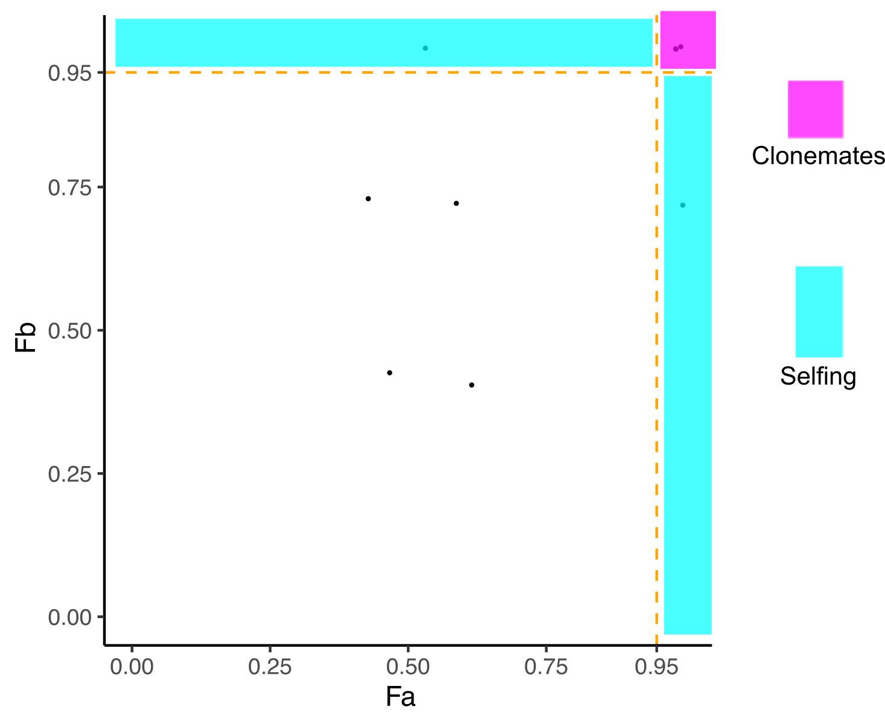

# **sharedHet.py**: a Python script for detecting asexual reproduction and selfing for diploid species based on shared heterozygosity.

For each pair of samples A and B, **sharedHet.py** calculates the following numbers:

**Na**: number of loci where sample A is heterozygous and sample B doesn't show missing value.

**Nab**: number of loci where both sample A and sample B are heterozygous.

**Nb**: number of loci where sample B is heterozygous and sample A doesn't show missing value.

**Fa**: Nab/Na

**Fb**: Nab/Nb

**plot.R** can be used to process the output of **sharedHet.py** (see an example in results/01_sharedHet.txt), and detect asexual reproduction and selfing (see an example in results/results.png).

## Usage:
**sharedHet.py** [-h] *vcf_path* *sample_pop_list*

**positional arguments**:

  *vcf_path*:         The path to the vcf file.

  *sample_pop_list*:  The path to a file containing sample names and the corresponding population names.

**optional arguments**:

  -h, --help       show this help message and exit

**output**:

  01_sharedHet.txt

## Examples:
Input examples can be found in folder "example".

example/example.vcf: an example for the vcf file.

example/sample_pop.txt: a file containing the sample names and corresponding population names. The sample names are the ones based on which you want to do the calculation. They can be a subset of sample names in the vcf file. **sharedHet.py** only do pairwise calculation for samples within the same population.

Usage example:

**sharedHet.py** example.vcf sample_pop.txt

**plot.R** can be used for processing the result "01_sharedHet.txt", and make the plot.

## Contact:
This script was written by Lei Yu, Marine Evolutionary Ecology Group, GEOMAR Helmholtz Center for Ocean Research Kiel, Germany.

Email: leiyu2010ouc@outlook.com
